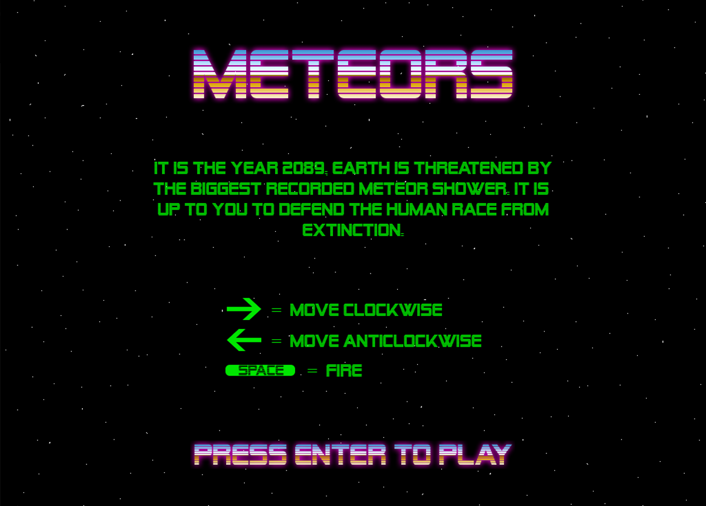
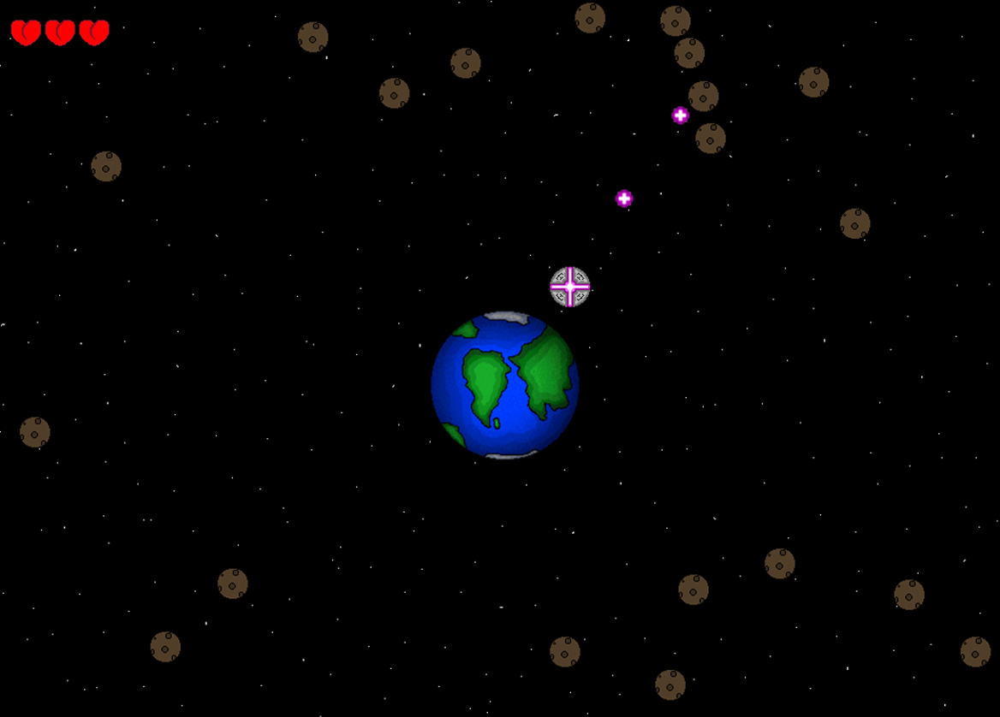

### About Me

**My name is Joshua Todd, I am a 21 year old student studying in the UK.
Here I plan to showcase the work that I have completed and any ongoing projects.**

# Team Projects

## Ink Samurai

Ink Samurai is an on-going project that started in Helsinki as a result of the Erasmus+ opportunity.
Students were flown over to Helsinki to form a team of artists and developers to create a game prototype in 2 weeks.
My role in the team was the Project Manager, the team is comprised of 7 members, their names are credited in the last image.

In Ink Samurai the objective of the game is to survive as long as possible, the player has 3 lives as indicated in the top right corner of the screen. The core mechanic of the game is that you can only move when attacking, therefore movement is not possible if there is not an enemy in range. A score is given at the end and points are earned by defeating demons.

This project has many features planned to improve the gameplay experience, we expect a release by the end of May.

Below are images of the protoype mobile game Ink Samurai.

## Mechaten

Mechaten is another game where I have taken the role of Project Manager. Mechaten is in the very early stages of development, it is a 3D fighting game set in a destructible city with inspiration taken from the 2002 title Godzilla: Save the Earth. It is being created by a team of 9 as a final end of year assignment with a release planned 20th May.

*- Updates will appear when we are further into development.*

# Coding Skills

## Meteors

Meteors is a game written in C++ with Directx 9 DirectDraw in Visual Studio. It was part of one of my assignments on my foundation course.

Shown below is the visuals and a link to the specification document showing all the code.

[Specification Document](http://Portfolio/Meteors/Report.pdf)

## Game of Life

The game is a simulation to replicate the original game of life with the rules:

* Any live cell with fewer than two live neighbors dies, as if by underpopulation.
* Any live cell with two or three live neighbors lives on to the next generation.
* Any live cell with more than three live neighbors dies, as if by overpopulation.
* Any dead cell with exactly three live neighbors becomes a live cell, as if by reproduction.

There are also a few extra small simulations in the menu system.

## Prime Numbers
